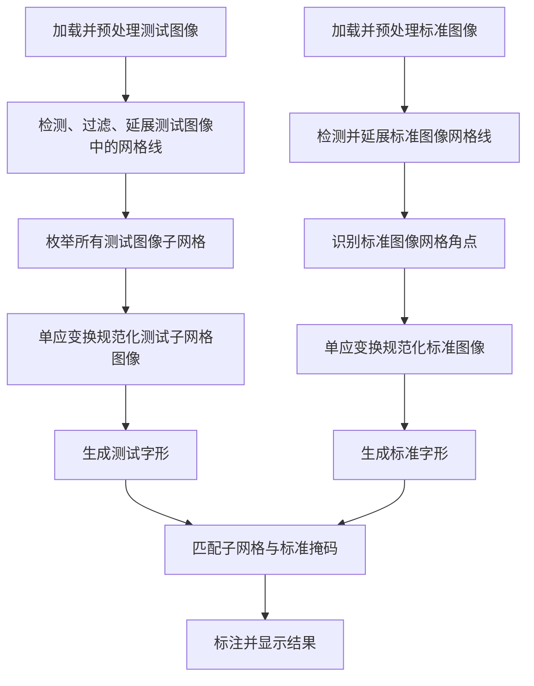

# Auto Calli

基于传统视觉算法和OpenCV的自动化书法评价系统

## Pipeline


```mermaid
graph TD
    A[加载并预处理标准图像] --> B[检测并延展标准图像网格线]
    A2[加载并预处理测试图像] --> B2[检测、过滤、延展测试图像中的网格线]
    B --> C[识别标准图像网格角点]
    B2 --> C2[枚举所有测试图像子网格]
    C --> D[单应变换规范化标准图像]
    C2 --> D2[单应变换规范化测试子网格图像]
    D --> E[生成标准字形]
    D2 --> E2[生成测试字形]
    E2 --> F[匹配子网格与标准掩码]
    E --> F
    F --> G[标注并显示结果]
```

## Usage

```shell
pip install -r requirements.txt
# edit demo.py to change the image path
python demo.py
```